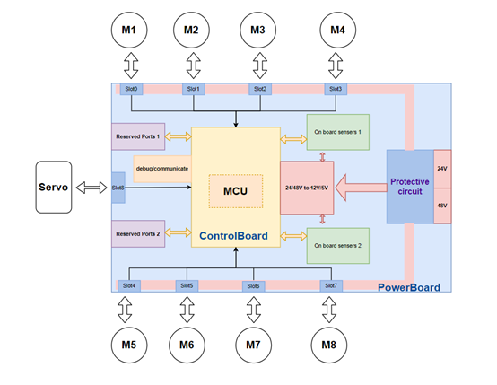
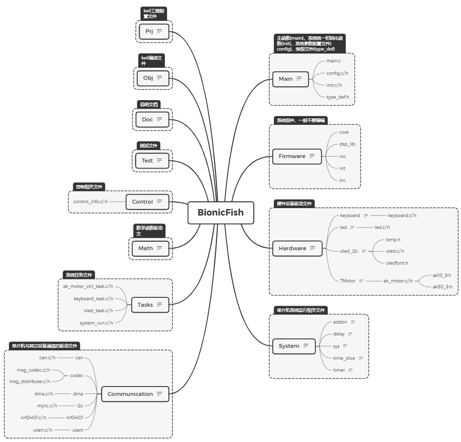
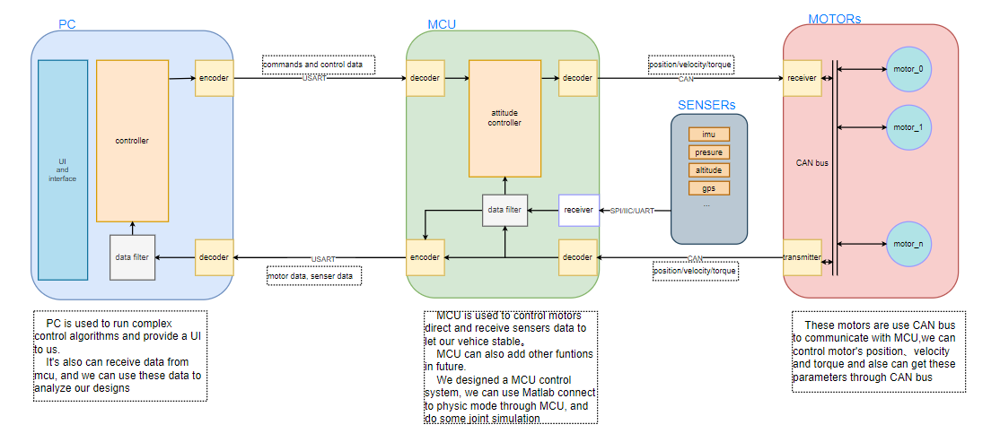
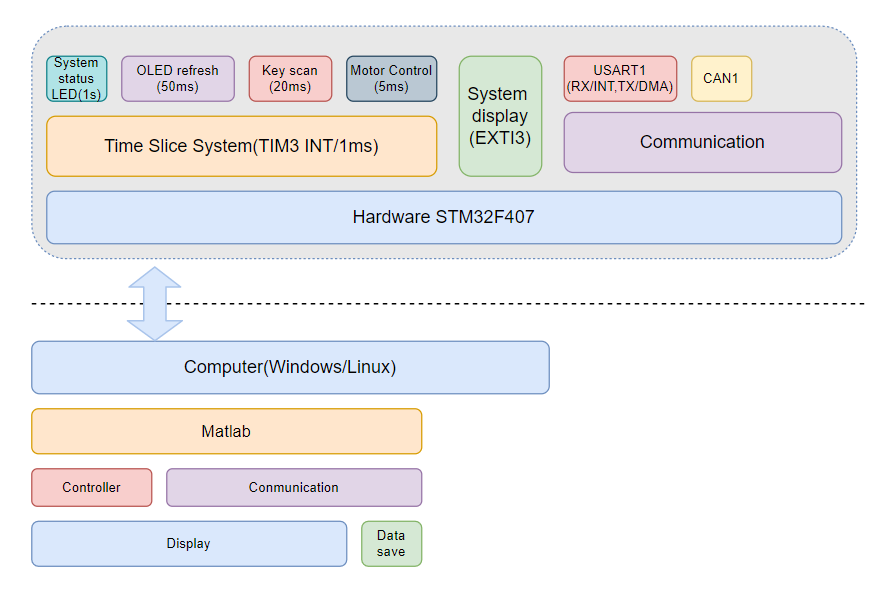
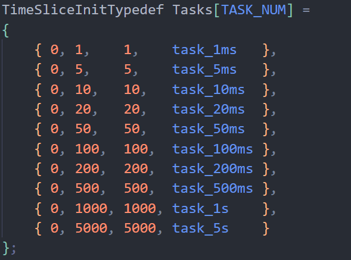
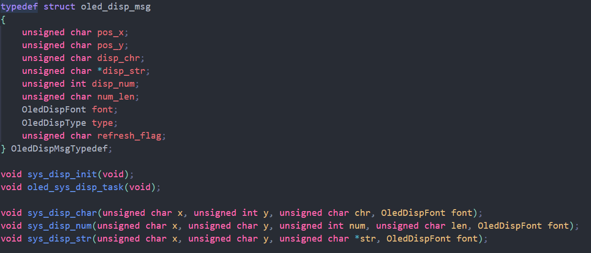
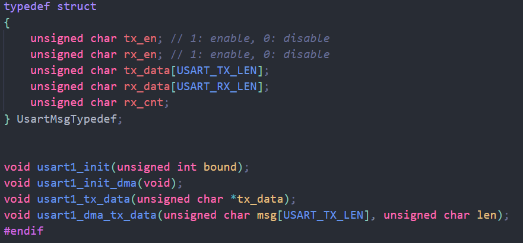
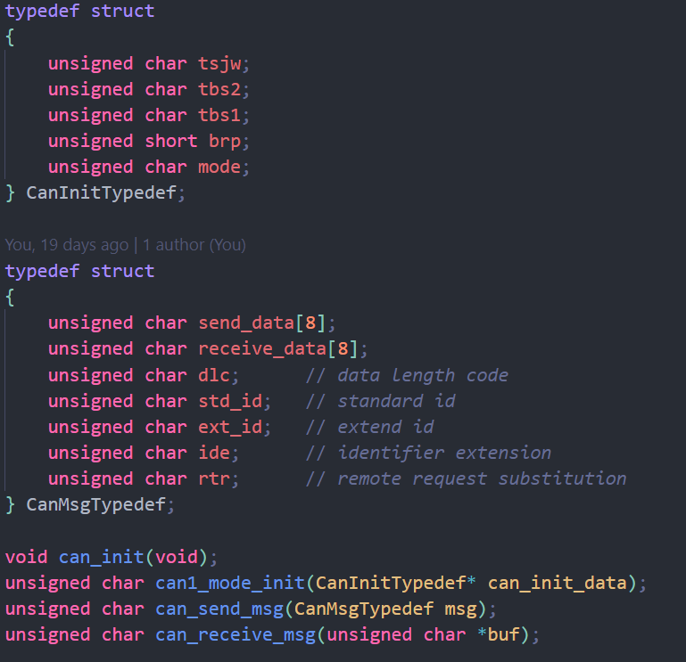
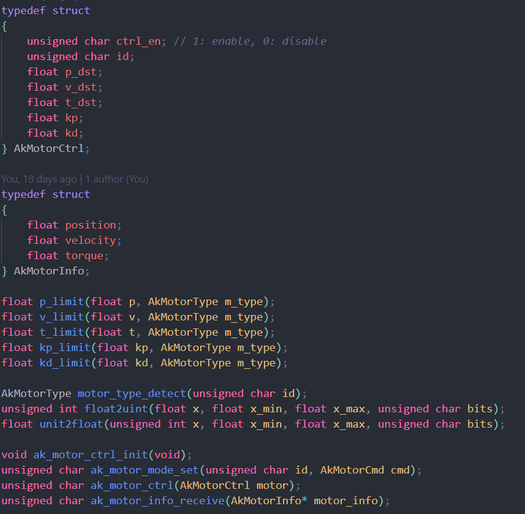
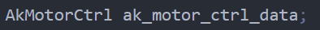

# WIAS 仿生鱼控制系统底层设计

## 一、系统架构

### 1.1 硬件架构

#### 1.1.1手工焊接初步测试版本引脚设置

- **OLED_0.96IIC**

| SCL  | SDA  |
| :--: | :--: |
| PB13 | PB14 |

- **TJA1050 CAN收发器 (CAN1)**

| CAN_TX | CAN_RX |
| :----: | :----: |
|  PA12  |  PA11  |

- **STM32系统板硬件资源**

| KEY_1 |  D2  |
| :---: | :--: |
|  PA0  | PA1  |

- **NRF24L01(SPI3 Port Remap)**

| IRQ  | MISO | MOSI | SCLK | CSN  |  CE  |
| :--: | :--: | :--: | :--: | :--: | :--: |
| PD0  | PC11 | PC12 | PC10 | PD1  | PA15 |

- **USART (USART1)**

|  TX  |  RX  |
| :--: | :--: |
| PA9  | PA10 |

#### 1.1.2 硬件设备参数

**TMotor 参数范围**

|        | 位置(rad) | 速度(rpm) | 转矩(n*m) |   Kp    |  Kd   |
| :----: | :-------: | :-------: | :-------: | :-----: | :---: |
| AK80-9 |   ±95.5   |    ±45    |    ±18    | 0 - 500 | 0 - 5 |
| AK10-9 |   ±95.5   |    ±45    |    ±54    | 0 - 500 | 0 - 5 |

其中AK10-9电机位置控制时，电机实际输出的角度时输入角度的1/10  (2021/01/24测试发现)，可通过将目标参数扩大10倍作为输入值来解决该问题。

### 1.2软件架构

- **单片机软件目录结构**

软件共有12个一级文件夹，分别存放不同功能代码或文件，其中*"Obj"*, *"Prj"*, *"Doc"*分别存放：keil编译后文件、工程结构文件和软件相关说明。

-- *“System”* 文件夹下包含了有关系统运行的文件，其中*"timer_slice"*中的文件为本系统使用的程序架构---*时间片轮询法*；

-- *"Tasks"*文件夹下包含系统所运行的任务代码文件；

-- *"Communication"*文件夹下包含系统与外界通信的驱动文件，目前包括串口通信、I2C通信、CAN通信以及通信编解码函数；

-- *"Hardware"*文件夹下包含系统外部设备的驱动文件，包括：电机驱动、OLED显示屏驱动、按键驱动以及LED灯驱动；

-- *"Firmware"*文件夹下包含单片机底层文件库，该部分文件一般不能改动；

-- *"Main"*文件夹下包含系统初始化文件、系统模式配置文件、主函数文件和全局类型文件；

-- *"Control"* 文件夹下包含系统控制文件，目前没有添加，后期单片机上的控制方法实现文件都放于该文件夹下；

-- *"Test"*文件夹下包含一些系统设计过程中的一些测试代码文件.

#### 1.2.1 控制系统整体结构

控制系统分为3个部分，分别是顶层由PC端控制，主要是实现复杂的控制算法； 中层由MCU实现控制，直接从机在传感器获得航行器的姿态信息，直接对航行器的姿态进行控制，使航行器处于稳定状态，并向上位机实时发送航行器的姿态以及其它状态信息；底层是电机的控制，使电机能够在规定时间以规定的状态到达规定的位置，目前电机上应用的使FOC控制方法。

上位机与单片机之间的通信采用串口通信，上位机将浮点型数据编码成字符型数据通过串口下发到单片机，单片机通过相应的解码函数进行解压后结合电机返回的信息以及机身传感器返回的信息对电机机型控制，单片机和电机之间采用的CAN总线进行通信同样需要将浮点型数据进行相应的编码后进行发送。

#### 1.2.2 控制器架构

下位机控制器采用STM32F407单片机，系统可分为三个部分：时间片轮询部分、系统显示部分和通信部分，这单个部分单独实现互不影响，只能通过相应的接口进行交流。

- **时间片轮询部分**

时间片轮询使用TIM3定时器及其中断，时间片可自行划分，最小时间片为1ms。

时间片轮询作为系统任务的执行部分，可以根据需求增加相应的时间片任务，目前最基本的任务有：

-- LED闪烁任务，用于判断系统是否正常运行；

-- OLED刷新，上面运行着一个计数器，计数器的值每隔50ms加一并显示，用以判断系统是否卡顿；

-- 按键检测任务，按键检测任务每隔20ms执行一次；

-- 电机控制任务，周期为5ms，该任务只在连续控制时才使用，当使用上位机直接控制时该任务不被创建。

若要创建相应的任务时间片，在下面这个结构体数组中增加相应的函数，并在*"task.h"*中更改相应的*"TASK_NUM"*.

- **系统显示部分**

由于系统对时序要求较为严格，如果直接在时间片轮询中创建显示函数，那么在一些中断中会打断显示函数的执行，导致花屏，故将显示功能独立出来作为系统显示。

系统显示使用软中断实现，显示中断的抢占优先级和串口通信的优先级相同，子优先级低于串口通信优先级，故在串口通信的中断中不能使用系统显示函数。实现方式是将显示参数通过结构体传递，调用系统显示函数时会产生一个软中断，中断函数入口是外部中断3.

相应的接口如下:

- **通信部分**

通信部分主要包括串口和CAN通信部分，以后和传感器之间的通信按时间要求，时间较长的可以创建相应的时间片，时间短的可以使用定时器中断实现，一般不包含在这个部分。

串口通信部分用以接收上位机控制指令以及上传航行器信息，上传通过串口DMA方式减少CPU开销，以提高数据交互速率；数据接收是通过中断接收，规定每次接收一帧30字节的数据，其中包括帧头和帧尾。串口每接收到上位机的一帧数据回向上位机反馈相应的数据，在上位机直接单次控制中每接收一帧电机控制信息，就控制一次电机并反馈电机此时的状态，具体实现见*串口接收中断函数*

串口通信接口如下：

CAN总线通信部分是于电机进行通信，速率为1Mbps,电机的控制信息压缩在一个CAN的数据帧中(8字节)，每发送一帧数据便接收一帧数据。

CAN总线接口如下：

电机控制接口如下：

对外接口为最后4个函数，前面的函数为电机驱动内部调用。

与电机的通信部分有几个主要的全局结构体，如下：

-- 串口信息：

-- 电机控制参数：

## 二、 数据格式

### 2.1 控制信号

**格式：**

| SOF  |   MODE   |    SIZE    | DATA0 | ...  | DATAx |    FCS_h    |    FCS_l    | EOF  |
| :--: | :------: | :--------: | :---: | :--: | :---: | :---------: | :---------: | :--: |
| 帧头 | 控制模式 | 数据段大小 | 数据0 | ...  | 数据x | 帧校验高8位 | 帧校验低8位 | 帧尾 |

-- **SOF :**帧头，固定为 *'{ '*.

-- **EOF: **帧尾，固定为 *'}'*.

-- **FCS_h/FCS_l: **数据校验和的高8位和低8位，采用CRC16校验，2字节.

-- **MODE: **控制模式，其中MODE0保留，不用做控制模式，但可以用此模式来接收下位机信息而不做控制.

-- **SIZE: **此次传输数据段大小, DATA0 - DATAx 的字节数.

-- **DATA1-DATAx: **数据段，如果没有数据，这段可以去除，此时SIZE应该为0.

-- **数据字段最大为255字节**

- **MODE 说明**

-- 0：保留

-- 1：解锁电机

-- 2：电机上锁

-- 3：设置电机零点

-- 4：控制电机

#### 2.1.1 电机控制信号

**电机控制信号分为4种模式，MODE1为解锁电机，MODE2为电机上锁，MODE3为设置电机零点，MODE4为控制电机运动。**

- **MODE1信号格式**

| SOF  | MODE | SIZE | DATA0 | ...  | DATAx |  FCS_h  |  FCS_l  | EOF  |
| :--: | :--: | :--: | :---: | :--: | :---: | :-----: | :-----: | :--: |
|  {   |  1   |  x   |  ID1  | ...  |  IDx  | crc16_1 | crc16_0 |  }   |

-- 此模式下DATA字段为要解锁的电机ID号.

- **MODE2信号格式**

| SOF  | MODE | SIZE | DATA0 | ...  | DATAx |  FCS_h  |  FCS_l  | EOF  |
| :--: | :--: | :--: | :---: | :--: | :---: | :-----: | :-----: | :--: |
|  {   |  2   |  x   |  ID1  | ...  |  IDx  | crc16_1 | crc16_0 |  }   |

-- 此模式下DATA字段为要上锁的电机ID号.

- **MODE3信号格式**

| SOF  | MODE | SIZE | DATA0 | ...  | DATAx |  FCS_h  |  FCS_l  | EOF  |
| :--: | :--: | :--: | :---: | :--: | :---: | :-----: | :-----: | :--: |
|  {   |  1   |  x   |  ID1  | ...  |  IDx  | crc16_1 | crc16_0 |  }   |

-- 此模式下DATA字段为要设置零点的电机ID号.

- **MODE4信号格式**

| SOF  | MODE | SIZE | DATA0 - DATAx |  FCS_h  |  FCS_l  | EOF  |
| :--: | :--: | :--: | :-----------: | :-----: | :-----: | :--: |
|  {   |  4   |  x   |  见下面描述   | crc16_1 | crc16_0 |  }   |

***MODE4数据段格式***

| id     | P_h       | P_l       | V_h       | V_l       | T_h       | T_l       | Kp_h    | Kp_l    | Kd_h    | Kd_l    |
| ------ | --------- | --------- | --------- | --------- | --------- | --------- | ------- | ------- | ------- | ------- |
| 电机id | 位置高8位 | 位置低8位 | 速度高8位 | 速度低8位 | 转矩高8位 | 转矩低8位 | Kp高8位 | Kp低8位 | Kd高8位 | Kd低8位 |

-- 每个电机的控制信息首位相连，上一个电机的Kd_l后紧接着就是下一个电机的id.

-- 此模式下一个电机的控制信息要使用11个DATA段，SIZE的大小为11乘以要控制电机的个数，MODE为4，帧头和帧尾分别为 *‘{’* 和 *‘}’* .

-- 该模式除DATA段比较多而外和其它模式相同.

- **通信编码方式**

-- 若是传输数据为char型：直接传输，

-- 若传输数据为float型：将该数据乘以100后分为两个char型数据传送，接收端收到后进行解码 (需要注意数据大小，数据不能过大).

-- 帧尾前2个字节为该帧数据的校验位，校验采用CRC16校验方法

### 2.2 回传信号 

**格式： **

| SOF  |   TYPE   |    SIZE    | DATA0 | ...  | DATAx |    FCS_h    |    FCS_l    | EOF  |
| :--: | :------: | :--------: | :---: | :--: | :---: | :---------: | :---------: | :--: |
| 帧头 | 信号类型 | 数据段大小 | 数据0 | ...  | 数据x | 帧校验高8位 | 帧校验低8位 | 帧尾 |

-- **SOF: **帧头，固定为 *’{‘*.

-- **EOF: **帧尾，固定为 *’}‘*.

-- **FCS_h/FCS_l: **数据校验和的高8位和低8位，采用CRC16校验，2字节.

-- **TYPE: **返回信号类型，如电机信号、传感器信号等.

-- **SIZE: **此次传输数据段大小, DATA0 - DATAx 的字节数.

-- **DATA1-DATAx: **数据段，如果没有数据，这段可以去除，此时SIZE应该为0.

- **TYPE 说明**

-- 0：保留

-- 1：电机信息

#### 2.2.1 电机信息回传

- **电机信息回传格式**

| SOF  | TYPE | SIZE | DATA0 - DATAx |  FCS_h  |  FCS_l  | EOF  |
| :--: | :--: | :--: | :-----------: | :-----: | :-----: | :--: |
|  {   |  4   |  x   |  见下面描述   | crc16_1 | crc16_0 |  }   |

***电机信息回传数据段格式***

|   id   |    P_h    |    P_l    |    V_h    |    V_l    |    T_h    |    T_l    |
| :----: | :-------: | :-------: | :-------: | :-------: | :-------: | :-------: |
| 电机id | 位置高8位 | 位置低8位 | 速度高8位 | 速度低8位 | 转矩高8位 | 转矩低8位 |

-- 每个电机的控制信息首位相连，上一个电机的T_l后紧接着就是下一个电机的id.

-- 此模式下一个电机的控制信息要使用7个DATA段，SIZE的大小为7乘以要回传信息的电机的个数，MODE为4，帧头和帧尾分别为 *‘{’* 和 *‘}’* 

-- 该模式除DATA段比较多而外和其它模式相同.